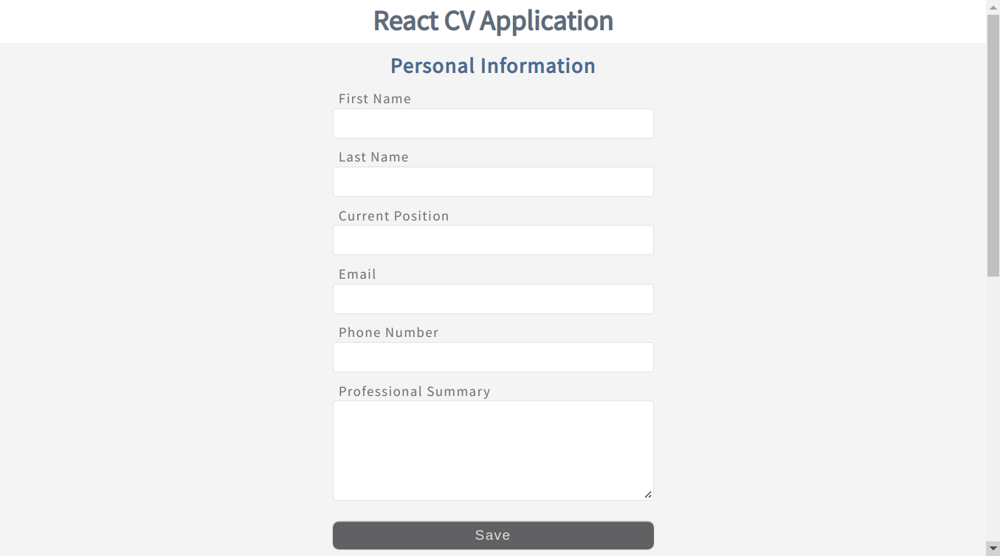
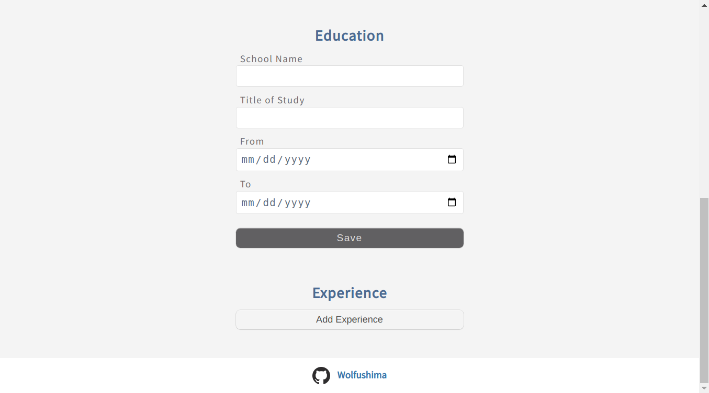
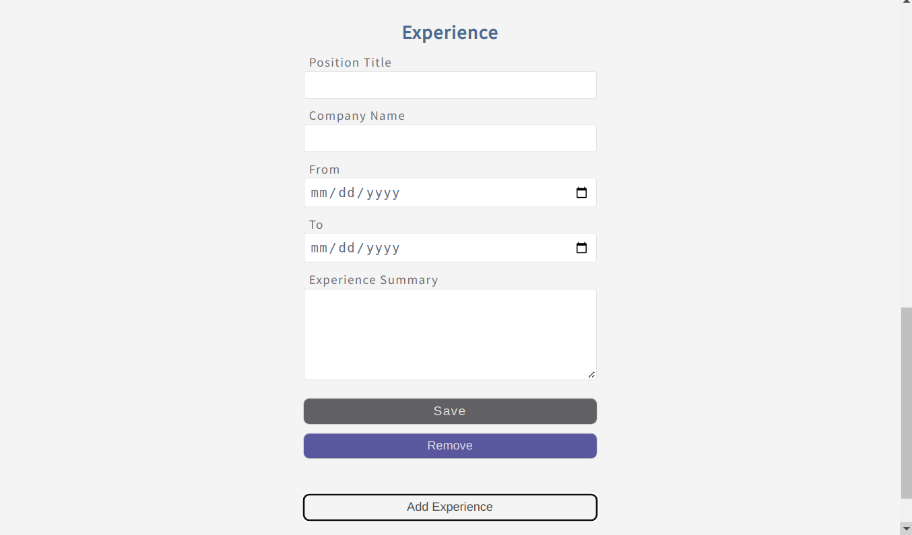
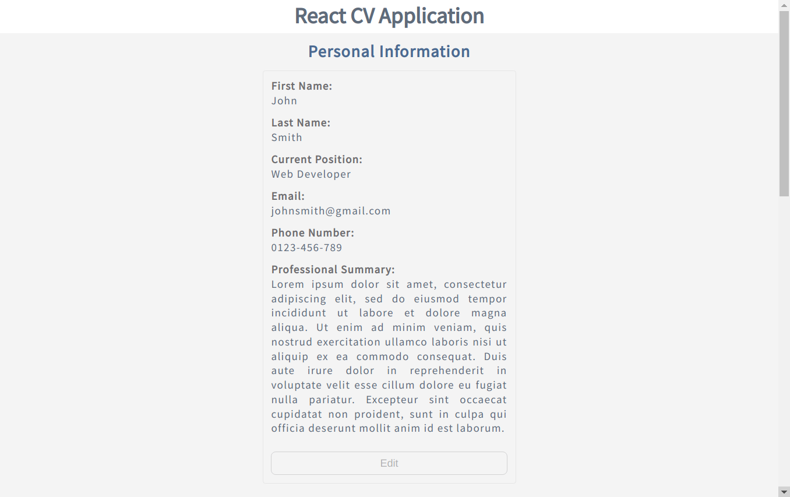
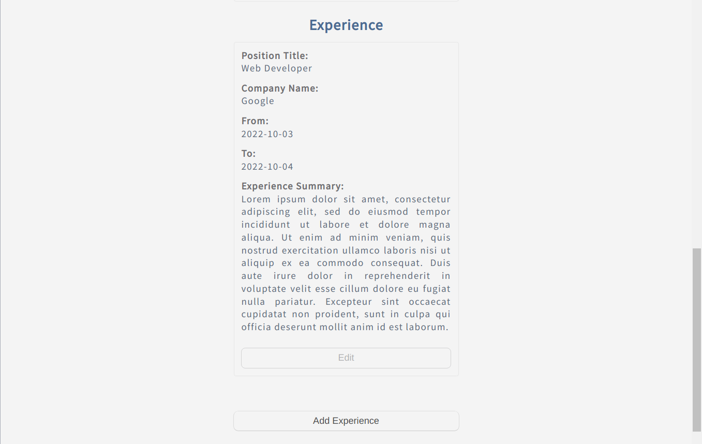

# React CV Application

This project was bootstrapped with [Create React App](https://github.com/facebook/create-react-app).

## Live Demo

https://wolfushima.github.io/react-cv-application/

## Description

This is my CV application built to learn and understand the basics of React such as:

- Building and learning the differences between Class Components and Functional Components
- State and Props:
  - How to pass functions, state, or other values between components as `props`
  - The purpose of `state` in a React component
  - The importance of using `setState()` instead of mutating state directly
  - How to attach event listeners to elements in React
- Rendering lists in React
- How to handle input fields and `forms` in React

## Built with

- React
- JavaScript
- HTML
- CSS
- Sass
- Uniqid

## Screenshots

<kbd></kbd>

<kbd></kbd>

<kbd></kbd>

<kbd></kbd>

<kbd></kbd>
